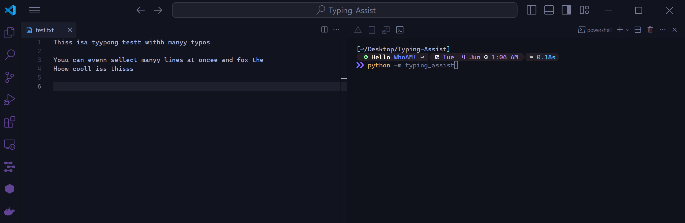

<div align="center">


**Typing-Assistant** is a script that can run in the background and listen to hotkeys, then uses a Large Language Model to fix the text.

</div>

## Get Started

### 1. Set up Ollama

Ollama Installation: https://ollama.com/

-   Click Download > Download for windows
-   After installed ollama, open up your terminal
    > Run `ollama run mistral:7b-instruct-v0.2-q4_K_S`

Mistal 7B Instruct works well for this task, but feel free to try other models, too :)

### 2. Install dependencies

**Using** _`poetry`_

```
git clone https://github.com/x404xx/Typing-Assist.git
cd Typing-Assist
poetry shell
poetry install
```

**Using** _`pip`_

```
git clone https://github.com/x404xx/Typing-Assist.git
cd Typing-Assist
virtualenv env
env/scripts/activate
pip install -r requirements.txt
```

-   pynput: https://pynput.readthedocs.io/en/latest/
-   pyperclip: https://github.com/asweigart/pyperclip
-   httpx: https://github.com/encode/httpx/
-   rich: https://rich.readthedocs.io/en/latest/

### 3. Run it

Start the assistant:

```
python -m typing_assist
```

Hotkeys you can then press:

-   ## *F9: Fixes the current line (without having to select the text)*



-   ## *F10: Fixes the current selection*


-  ## *ESC: To stop the program*

## **Legal Disclaimer**

> [!Note]
> This was made for educational purposes only, nobody which directly involved in this project is responsible for any damages caused. **_You are responsible for your actions._**
